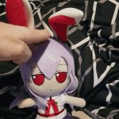
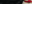

# discord-gif-raster
### Command line program to split a gif into blocks to be uploaded and boasted about in discord

---

To use it:

* Get the binary (probably by downloading it from releases)
* I recommend you place in a folder with the gif you want to rasterize
* Run it with `raster -f <filename.gif>`
* Upload newly generated files in gifs/ directory (you can multi-upload if you select all on discord)
* Copy the text and paste into your favorite server

You can set minimun number of gifs for both directions like

`raster -f bunpats.gif -h 3 -v 3`

This will not always give you 3x3, but it will at LEAST be 3x3. Depending on your image's aspect ratio, it'll determine how many more gifs over the minimum you'll be.

To build:

* `go get bitbucket.org/marvinody/discord-gif-raster`
* `go build -o raster bitbucket.org/marvinody/discord-gif-raster`

Sample:

 

 

 
